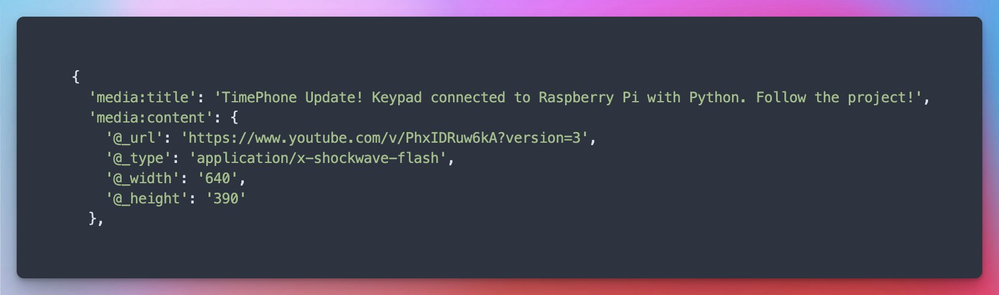
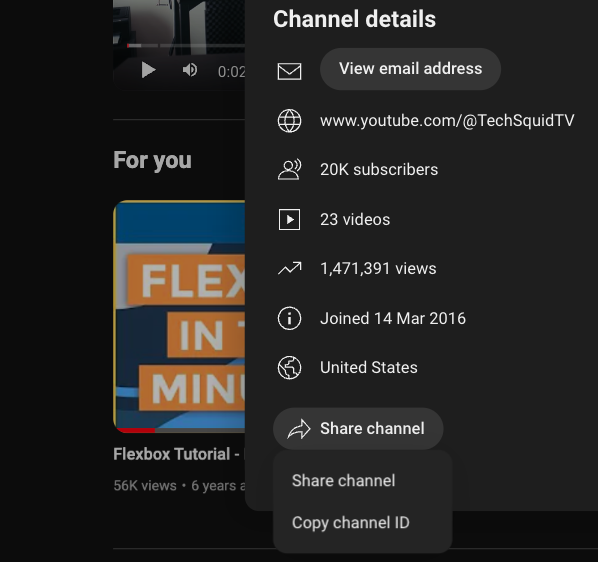
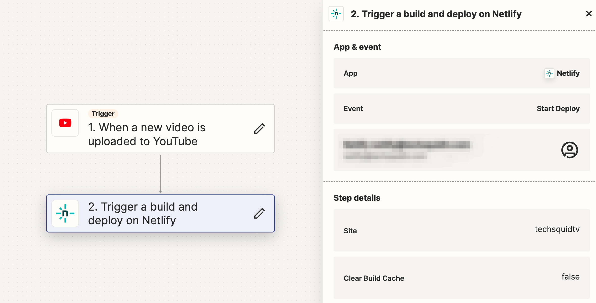

import LatestYouTube from "@components/Headless/LatestYouTube.astro";

One of the most common reasons you'll hear someone mention that they need a full backend server running for their personal website, is for "dynamic" content. For example, you might want to show your latest YouTube video on your homepage, which requires making an authenticated request to the YouTube API, and now you need to proxy that request through your server to keep your API key secret. Wildly complicated for fetching a YouTube video, and how often are videos uploaded? Once a week? Once a month? Let's explore another option.

Using [Astro](https://astro.build), [RSS](https://en.wikipedia.org/wiki/RSS), and a service like [Zapier](https://zapier.com/), we are going to update our website with our latest YouTube video, without a backend server, with no API keys, automatically, and completely for free.

## Why build a static website?

I'm a huge fan of static sites, when the situation allows for it. Static sites are secure, require little to no maintenance, are incredibly fast, and are typically free to host. This site was built with [Astro](https://astro.build), a static site generator, and is currently hosted on [Netlify](https://www.netlify.com/) completely for free (Also checkout [Cloudflare Pages](https://pages.cloudflare.com/), and [Vercel](https://vercel.com/)). Static sites are treated just as a set of small files, and small files are easy to cache and serve quickly all over the world with the help of a CDN like the ones provided by Netlify, Cloudflare, and Vercel automatically.

Typically static sites are fairly limited, mostly consisting of a theme and a content source. But, with Astro, we can use JavaScript and TypeScript to describe any aspect of our build process. This means we can fetch data from anywhere, and build our site with that data. If we had a backend server, we could fetch the latest YouTube video at the time of the request, which would be important if we needed to ensure we displayed the latest video immediately. But, if we are okay with some amount of delay, we can simply fetch that data once, and rebuild our site.

## Fetching YouTube videos with RSS

We have two problems we want to solve for, fetching the latest YouTube videos, and building the site automatically when we upload a new video. Let's first focus on how we will obtain the latest YouTube videos.

The first key difference in our static site workflow, is we are using Astro. While we could write plugins for other static site generators like Hugo or Jekyll, Astro allows us to go beyond simple templates and plugins, and instead use TypeScript or JavaScript to describe any aspect of our build process. We could, just as we typically would in a traditional server-based website, communicate with the YouTube API to fetch the latest videos and build our site with that data. But, because we won't be updating this information very often and we don't need any non-public information, we can get away with a much simpler solution.

### How to get the RSS feed for a YouTube channel

Remember RSS? Youtube may have actually forgotten about it, because if you check the RSS feed for a channel, you'll see they still refer to the video's mimetype as `x-shockwave-flash`. 

[](https://x.com/TechSquidTV/status/1736603761655599487)

Hopefully that gets updated rather than Google sunsetting another service, because that would be oh so uncharacteristic of them. Right?

For now, while we can, let's take advantage of this free and easy way to get everything we need about the latest videos from a YouTube channel. First, get the channel's ID.

#### How to get the channel ID

The best way to find the channel ID:

1. Visit the channel's YouTube page (the channel ID may appear in the URL in some cases)
2. Click the channel's about section to open the about panel
3. Click the "Share Channel" button
4. Click "Copy Channel ID"



#### How to get the RSS feed

Now that we have the channel ID, we can construct the URL for the RSS feed. The URL is: 
```txt
https://www.youtube.com/feeds/videos.xml?channel_id=${channelID}
```
 Replace `{channelID}` with the channel's ID.

### Building The YouTube Astro Component

If you want to see the [full source](https://github.com/TechSquidTV/website/), you can see the code for the component used on this site [on GitHub](https://github.com/TechSquidTV/website/blob/main/src/components/Headless/LatestYouTube.astro). For the adventurers, let's break down how it works.

Before we begin, we need a way to read the RSS feed, which is just a form of XML. Install the `fast-xml-parser` package with your preferred package manager.

```shell
pnpm add fast-xml-parser
```

#### Create LatestYouTube.astro

First, create a component file named `LatestYouTube.astro`. This file will both fetch and display the latest YouTube video.
We'll start with our imports and prepare some types to help us work with the XML data. We can look at the RSS feed for a channel to see what data we can expect, or copy what we have here.

```tsx title="LatestYouTube.astro"
import { Image } from "astro:assets";
import { XMLParser } from "fast-xml-parser";

type Author = {
  name: string;
  uri: string;
};

type YouTubeRSSFeed = {
  link: string[];
  id: string; // yt:channel:{id}
  "yt:channelId": string;
  title: string;
  author: Author;
  entry: YouTubeRSSEntry[];
};

type YouTubeRSSEntry = {
  id: string; // yt:video:{id}
  "yt:videoId": string;
  "yt:channelId": string;
  title: string;
  link: string;
  published: string;
  updated: string;
  author: Author;
  "media:group": YouTubeRSSMediaGroup;
};

type YouTubeRSSMediaGroup = {
  "media:title": string;
  "media:description": string;
  "media:content": {
    "@_url": string;
    "@_type": string;
    "@_width": string;
    "@_height": string;
  };
  "media:thumbnail": {
    "@_url": string;
    "@_width": string;
    "@_height": string;
  };
};

type YouTubeRSS = {
  feed: YouTubeRSSFeed;
};

type Props = {
  channelID: string;
};
```

Our `LatestYouTube` component will accept a `channelID` prop, which will allow us to fetch the latest video from any channel. We'll use the `fetch` API to get the RSS feed, and then parse the XML with `fast-xml-parser` as the `YouTubeRSS` type we defined above. Finally, to grab just the latest video, we set `video` to the first entry in the `feed`'s `entry` array. 

```tsx title="LatestYouTube.astro"
const { channelID } = Astro.props;
const youtubeRSS = `https://www.youtube.com/feeds/videos.xml?channel_id=${channelID}`;
const rssData = await fetch(youtubeRSS).then((res) => res.text());

const options = {
  ignoreAttributes: false,
  attributeNamePrefix: "@_",
};
const parser = new XMLParser(options);

const rss = parser.parse(rssData) as YouTubeRSS;
const video = rss.feed.entry[0];
```

Now for the markup. This part is going to be subjective to your site's design. Here, I use `tailwind` with Astro's image component and an icon component to show an image of the video thumbnail with a play button overlay, and a link to the video. 

```tsx title="LatestYouTube.astro"
<div class="flex flex-col w-full h-full">
  <a href={video["media:group"]["media:content"]["@_url"]} target="_blank" class="flex-1 relative">
    <div class="absolute top-1/2 right-1/2 transform translate-x-1/2 -translate-y-1/2 m-2">
      <Icon name="playCircle" size={24} />
    </div>
      <Image
        class="rounded-lg object-cover object-center w-full h-full sm:h-48 md:h-52 xl:h-64 shadow-xl"
        src={video["media:group"]["media:thumbnail"]["@_url"]}
        alt={video["media:group"]["media:title"]}
        width={parseInt(video["media:group"]["media:content"]["@_width"])}
        height={parseInt(video["media:group"]["media:content"]["@_height"])}
      />
  </a>
    <div class="flex flex-1 flex-col justify-between py-2 mx-8">
      <h2 class="text-4xl font-bold text-smoke-50 mb-2 break-words">
        {video["media:group"]["media:title"]}
      </h2>
      <div class="my-1 text-sm">
        <a class="rounded-full inline-flex flex-row items-center px-2 ring-1 ring-smoke-800 text-smoke-300" target="_blank" href={video["media:group"]["media:content"]["@_url"]}>watch</a>
      </div>
    </div>
</div>
```

#### Demo the component

Here's a live demo of the component in action. Let's set the channel ID to someone a bit more active on YouTube than I am. Enjoy the latest video from [FreeCodeCamp](https://www.freecodecamp.org/)

<LatestYouTube channelID="UC8butISFwT-Wl7EV0hUK0BQ" />

### Automatically updating the site with the latest video

Now, we have a component that fetches and displays the latest YouTube video. The only problem is, it will only update if we rebuilt the site. If we automatically build the site every day or week, that might be enough. But, if you want to trigger a build as soon as you upload a new video, we can do that too.

This site is currently hosted on Netlify, but this should work with nearly any host. Sign up for a free account on [Zapier](https://zapier.com/), and create a new Zap. Connect the YouTube new video trigger to the Netlify build hook action.



Now, every time you upload a new video, your site will automatically rebuild and deploy with the latest video.

## Conclusion

With modern Jamstack hosting providers we can take advantage of serverless functions for dynamic content if we want, brining us even closer to the capabilities of a traditional server-based website. But, we can see that isn't always necessary. We are able to routinely fetch the latest YouTube video on every build, and even trigger a build automatically as soon as a new video is uploaded, and we were able to do it without any API keys, rate limits, completely for free.

If you enjoy a mix of dev content like this and other interesting tech topics, consider joining my newsletter below!