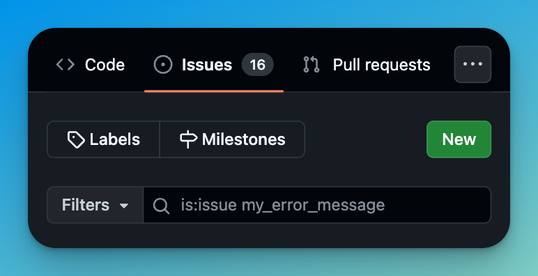
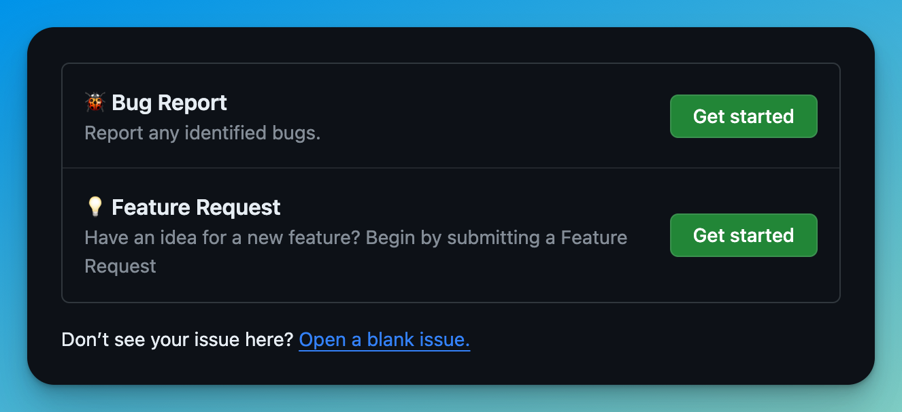
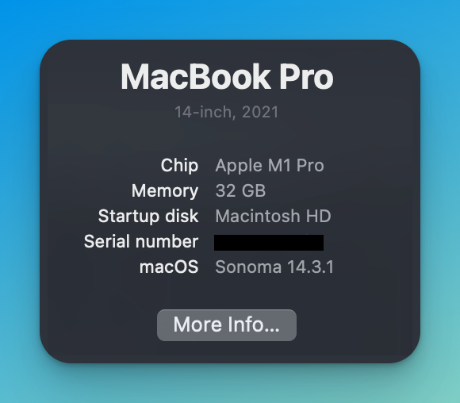
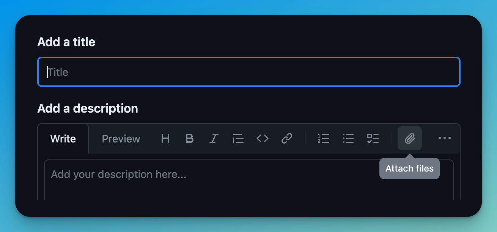

One of the main benefits of working in modern open source code is community interaction. It's how we learn, grow, and contribute to better and free software. Over the last four years, I led a team of three developers in building and maintaining over 70 open source projects. Fortunately, we weren't alone; we had the support of the open source community, filled with experts in various specialty areas and people willing to offer a helping hand. Of course, maintaining that many repositories also meant managing numerous open issues.

It was hardly a secret that the better prepared an issue was, the quicker we could respond, regardless of its age. A better prepared issue with easy to follow steps to reproduce and a clear description of the issue required so much less time to start diagnosing the problem, we could fix it with minimal back and forth. Conversely, if an issue simply stated that a user experienced a "bug" or something was "broken", with maybe a link, would require a lot of investigation and possibly long back and forth asynchronous communication to get a full picture of the problem.

So, let's discuss how you can create a great GitHub issue and maximize your chances of getting help from the maintainers and community.

## What To Do Before Creating An Issue

In the world of open source, we're fortunate to have access to software crafted through the dedication and hard work of countless individuals. These contributors generously donate their time and expertise to create something truly valuable for all of us, free of charge. Before creating an issue, I encourage you to take an extra moment to do some due diligence and take some steps to make it easier for other to help. You may even find the solution you need in preparation of asking for help.

### Check the Documentation

Before creating an issue, make sure you've thoroughly read the project documentation. Many projects may have multiple sources of information, such as formal documentation as well as additional guides or tutorials. If you're not sure where to start, check the project's README, wiki, or documentation.

### Read Contributor Guidelines

Most well-maintained open-source projects will have a [`CONTRIBUTING.md`](https://docs.github.com/en/communities/setting-up-your-project-for-healthy-contributions/setting-guidelines-for-repository-contributors#about-contributing-guidelines) file, usually in the root of the project or possibly in the `.github` directory. This file is a starting point for interacting with any open source project. It will typically include instructions for how to best contribute to that specific project, from submitting pull requests, to creating issues.

### Search for Similar Issues

Most contributor guidelines will request you perform a search to make sure the issue hasn't already been created. If you've searched, and the issue has already been created, you can join the conversation and add any information you may have and help others gain insights on the issue.



You may also find that a similar issue was created in the past and closed already. Either closed with a solution or a possibly a reason for the behavior.

## Creating A GitHub Issue

When creating a new issue in a repository, there may or may not be a [template](https://docs.github.com/en/communities/using-templates-to-encourage-useful-issues-and-pull-requests/configuring-issue-templates-for-your-repository) available to choose from. If there is an applicable template, you should likely use it. Templates added by the contributors should help guide you to creating a high-quality issue for that particular project.



If you don't find a template that suits your needs, you can start with a new blank issue. Whether or not there is a template, we can use the following principles to improve our issue writing.

## Writing a Good GitHub Issue (C.A.R.E.S.)

I've invented a framework for writing issues that I think provides a good template for effectively creating a high-quality issue. Create an issue like someone who **C.A.R.E.S.**

**C.A.R.E.S.** is a set of components every issue should contain, but is not limited to.

### Context

Give context to your issue by providing meta-information that may be relevant. Good information to include may be the version or release of the product you are using, your operating system, the runtime version, and any other relevant information. What information you include is going to depend on the type of project you are working with.

For example, say I was writing in an issue for an NPM package that was not installing. I might want to include some information such as, what operating system I'm using, which version of Node, the package manager, and the version of the package I am experiencing the issue with.

On Mac, you can find your OS information by clicking the Apple logo in the top left of the screen, and then clicking "About This Mac."



You can find similar information in [System Settings](https://support.microsoft.com/en-us/windows/which-version-of-windows-operating-system-am-i-running-628bec99-476a-2c13-5296-9dd081cdd808) on Windows.

You can also find your Node version by running `node -v` in your terminal, and similar with other tools. Given that, we might share context similar to this:

> - **Package Version**: 1.0.0 (this is the thing you are trying to use)
> - **Operating system:** MacOS Sonoma 14.3.1, M1
> - **Node Version**: v21.6.1
> - **Package Manager**: pnpm 8.15.1

This additional context can help contributors determine if maybe the package isn't compatible with the version of Node you may be using, or maybe the issue was already fixed in a newer version of the package.

### Action

What action triggered the issue? This might mean attempting to use a certain feature or functionality and running into an error. Try to provide reproducible steps to perform so that others can replicate your issue.

> Error is triggered when accessing the `count()` method on `Counter`.
>
> Steps to reproduce:
>
> 1. Create a new Counter object
> 2. Call the `count()` method
>
> ```typescript
> const c = new Counter();
> console.log(c.count());
> ```

### Result

What was the result of the action? This could be an error message, a log, or an unexpected behavior.

> Error:
>
> ```
> Property 'count' does not exist on type
> ```

Error messages and logs at this stage may help pinpoint exactly where in the code the problem lies. This step will greatly benefit from additional supporting assets (like screenshots and log files), which we'll go over soon, as the `S` in C.A.R.E.S.

### Expected

What was the expected result? This is what you expected to happen when you performed the action. Sometimes we report bugs and it might seem obvious that the expected result is to not have an error. Other times, we might have a perfectly valid result, just not the one we were expecting. In either case, it may help maintainers to understand fully where you are coming from with the added context of why you opened the issue, especially if maybe the maintainers believe the result is expected.

For instance, maybe you get an error back, but the maintainers of the project _intended_ for an error to occur for one reason or another. Your report that you expected something else to happen may help influence changing the functionality, or improving the error or documentation.

> After calling the `count()` method on `counter`, I expected to get back a result of `0` as the default value. I believe `0` should have been returned, as that appears to be what the documented behavior states \[here](link). However, when I attempted to call this method as I demonstrated, I received the error above.

### Supporting Assets

Screenshots, screen recordings, links, and any other assets that might be helpful should be included in the issue. GitHub will let you [drag-and-drop log files, images, and even videos into issues](https://docs.github.com/en/get-started/writing-on-github/working-with-advanced-formatting/attaching-files).



An important distinction to remember is screenshots are _not_ replacements for copy and pasting real code/text or links. Real code and text can be searched and copied, but screenshots and videos can provide excellent additional context.

Every major modern operating system has built-in tools for recording a small region of your screen. Need help recording your screen? Try these out:

- Windows: [Snipping Tool](https://www.microsoft.com/en-us/windows/learning-center/how-to-record-screen-windows-11#:~:text=To%20open%20Snipping%20Tool%2C%20simply,countdown%20begin%20for%20your%20recording)
- Mac: [Screenshot](https://support.apple.com/en-us/102618)
- Linux/Gnome: [Gnome Screenshot](https://help.gnome.org/users/gnome-help/stable/screen-shot-record.html.en)
- Linux/KDE: [KDE Spectacle](https://apps.kde.org/spectacle/)

## Issue Template

If you're looking for a template to guide you to creating a good issue, or even a good issue template for your own repository, consider including these "C.A.R.E." components. Here's a bare-bones template example you can adapt to your specific needs.

```markdown title="ISSUE_TEMPLATE.md"
## Brief Description

<!-- A concise summary of the problem you are experiencing. -->

## Context

<!-- Include relevant information about your environment. This may include the operating system, architecture, the version of the package of software, or the runtime version. -->

**Version:**

<!-- The version of the package of software you are using. -->

**Operating System:**

<!-- Your OS Type, Version, and CPU architecture -->

**Runtime Version:**

<!-- The version of the runtime (node for example) you are using, if applicable. -->

## Action

<!-- What you were trying to do? -->
<!-- Include steps to reproduce -->

## Result

<!-- What happened? -->
<!-- Share any errors, logs, or screenshots that can easily demonstrate the issue. -->

## Expected

<!-- What did you expect to happen? -->
<!-- Share exactly what you expected to happen, give an example -->

## Supporting Assets

<!-- Screenshots, screen recordings, links, and any other assets that might be helpful. -->
<!-- This does not need to be its own section, you can instead add assets in the appropriate section above. -->
```

## Before You Go

Thanks for contributing to open source! Whether you're reporting a bug in a popular repository or just asking a question about your own code, doing it in public gives everyone the opportunity to learn. Remember, we are all in this together, and we all value our time. By creating high-quality issues, you can help yourself and others by providing concise and accurate information upfront. Simply gathering the information needed to make good issue has often led me to the correct answer before even submitting it.

Did you know that even [this website is open source?](https://github.com/TechSquidTV/website) See a problem with this post? [Open an issue](https://github.com/TechSquidTV/website/issues/new) and let me know!

If you're interested in Open Source, and more content like this, consider joining my newsletter below! No ads, no spam, and no bullshit. Minimal updates, purely with more content like this post. Join below!
