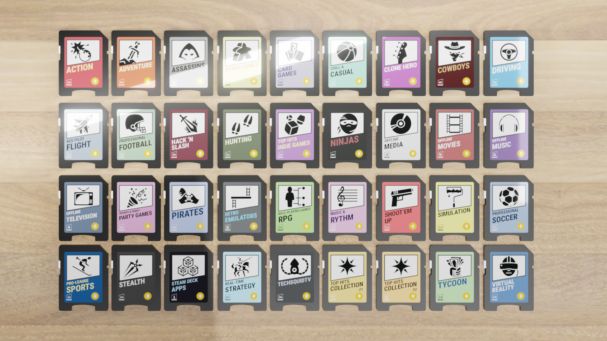
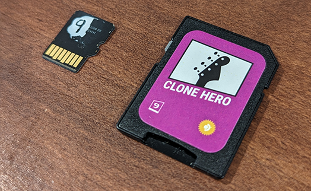

I finally picked up a Steam Deck and was impressed when a friend told me it was not only possible to store your games on MicroSD cards, but that it was also [encouraged by Valve](https://twitter.com/lawrenceyang/status/1416485869091913728), and they offer [similar performance to the internal SSD](https://www.pcgamer.com/first-tests-show-steam-deck-sd-card-speed-rivals-the-ssd/). This opens up a world of possibilities, considering many modern games are getting near 100Gb in size. 

I have a large collection of ROMs, Clone Hero songs, games, and apps that I'd like to have access to, and being able to keep multiple cards, like Nintendo Switch games, is a great way to manage my library. But, unlike a Switch game card, there's no way to keep track of what is on each MicroSD card without plugging it into a computer or the Steam Deck itself. So, I created a solution.

## Steam Deck SD Card Labels

This is a free and open-source design system, built on top of the [CC BY 3.0 Game-icons.net](https://game-icons.net/) library, that allows you to organize your MicroSD cards in an efficient and visually appealing way. The system consists of a full SDHC card adapter with a "box art" label that contains the artwork and a unique number. 

The number is used to match your MicroSD card to the adapter when they are not together. Using a paint pen, mark the MicroSD card with the same number as is printed on the adapter. This way, you can easily match the card to the adapter without needing to plug it in.

## Making your own

The designs are open source and available for [_free_ on GitHub](https://github.com/TechSquidTV/steam-deck-card-labels). Each design is downloadable as an SVG file, which can be printed on sticker paper at home and cut out, or printed using an online service. The designs are made to fit a standard SDHC card and the `OL28` label template available from online retailers.

* **Dimensions:** Each label is designed to fit within a 0.75" x 1" area, the typical size for a full-size SD card front label.
* **Printing:**
    * **Printer:** For the best results, a color laser printer and high gloss white paper are recommended. Due to the small size and limited paper choices, inkjet printers may not produce the best results.
    * **Paper:** [OL28 White Gloss Laser](https://www.onlinelabels.com/products/ol28) from OnlineLabels.com (not affiliated).
      * You can use a cheaper paper for inkjet printers, results may vary.

## Buy Steam Deck MicroSD Card Game Boxes

If you don't want to print your own stickers, you can buy any of these designs as pre-made SD card adapters with a plastic protective case on my Etsy store for $4 and support my side projects!

[Buy Steam Deck MicroSD Card Game Boxes on Etsy](https://www.etsy.com/listing/1671796721/steam-deck-microsd-card-game-boxes)

